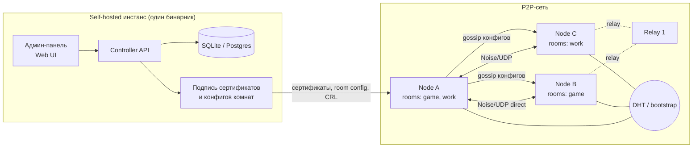

# zeropentime — архитектура

Открытая децентрализованная замена ZeroTier с админ-панелью.
**Комната (Room) = виртуальная локальная сеть.** Узел может состоять в нескольких комнатах одновременно.

> Окончательные технические решения — в [PLAN.md](PLAN.md): data plane на AmneziaWG 3 (`amneziawg-go`) вместо собственного Noise-транспорта, VLESS + Reality как запасной транспорт, доступ в интернет через exit-узлы, subnet router. Там, где документы расходятся, прав PLAN.md.

---

## 1. Цели и не-цели

**Цели**
- Любой может создать сколько угодно комнат и приглашать в них «своих».
- Узел подключён к N комнатам сразу, у каждой своя подсеть и свои правила.
- Нет единой точки отказа: если сервер-контроллер лёг, уже подключённые узлы продолжают работать и находить друг друга.
- Трафик всегда end-to-end шифрован; relay-узлы не видят содержимое.
- Всё self-hostable: контроллер, relay, панель — один бинарник.
- Админ-панель: управление экземпляром (глобально) и каждой комнатой.

**Не-цели на MVP**
- Собственная криптография (берём Noise / WireGuard-конструкции).
- Полноценный L2 (Ethernet bridging) — во второй фазе, см. §5.
- Мобильные клиенты — после десктопа.

---

## 2. Что «децентрализовано», а что нет

Админ-панель подразумевает, что у комнаты есть владелец. Противоречие снимается так:
**власть — у ключей, а не у сервера.**

| Функция | Как устроено | Централизовано? |
|---|---|---|
| Идентичность узла | Ed25519-ключ генерируется локально | Нет |
| Членство в комнате | Сертификат, подписанный ключом админа комнаты. Проверяется узлами офлайн | Нет (подпись можно сделать где угодно) |
| Контроллер комнаты | Любой узел/сервер, у которого есть ключ админа. Можно запускать внутри клиента владельца | Федеративно |
| Поиск пиров | DHT (Kademlia) + gossip внутри комнаты + список bootstrap-узлов | Нет |
| Relay (если NAT не пробивается) | Любой желающий поднимает relay, их много | Нет |
| Админ-панель | Веб-UI над API контроллера | Per-instance |

Итог: сервер нужен только для **изменений** (добавить/удалить участника). Для **работы** сети он не нужен.

---

## 3. Общая схема



Компоненты:
1. **`zpt-node`** — демон на каждом устройстве: TUN-интерфейсы, шифрование, NAT traversal, маршрутизация между комнатами.
2. **`zpt-controller`** — хранит комнаты/участников/инвайты/ACL, подписывает сертификаты, отдаёт API.
3. **`zpt-relay`** — STUN-подобное определение внешнего адреса + ретрансляция зашифрованных пакетов + bootstrap для DHT.
4. **Панель** — SPA поверх API контроллера.

Все три роли — один бинарник `zpt` с флагами (`zpt node`, `zpt controller`, `zpt relay`), как у Nebula/Headscale.

---

## 4. Криптография и идентичность

- **Node identity**: Ed25519 (подписи) + X25519 (обмен ключами). `NodeID = base32(blake2s(pubkey))[:16]`.
- **Room identity**: при создании комнаты генерируется *корневой ключ комнаты*. `RoomID = hash(room_root_pubkey)`. Подделать комнату нельзя — ID привязан к ключу.
- **Админы комнаты**: корневой ключ подписывает `AdminCert{admin_pubkey, role, expiry}`. Корневой ключ можно держать офлайн, а работать ключами админов (как CA → intermediate).
- **Сертификат участника**:
  ```
  MemberCert {
    room_id, node_pubkey,
    ip: 10.147.3.12/24,
    tags: ["gamer", "admin"],
    not_before, not_after,   // короткий срок, 24ч–7д, авто-продление
    issuer: admin_pubkey, signature
  }
  ```
- **Отзыв**: `RoomConfig` с монотонной `version` и списком отозванных NodeID, подписан админом. Распространяется gossip'ом; узлы принимают только большую версию. Короткий срок сертификатов страхует, если CRL не дошёл.
- **Транспорт**: Noise `IK` (как в WireGuard) поверх UDP, ChaCha20-Poly1305, ротация ключей сессии. Handshake включает предъявление `MemberCert` — пир без валидного сертификата комнаты не получает ни одного пакета этой комнаты.

---

## 5. Data plane: как комната становится «локальной сетью»

### MVP — L3 (TUN) с эмуляцией broadcast
- На каждую комнату — отдельный TUN-интерфейс (`zpt-game`, `zpt-work`) со своей подсетью. Отдельные интерфейсы = нативная изоляция на уровне ОС, свой firewall, понятный UI.
- Unicast: `dst IP → NodeID` по таблице из RoomConfig → шифрованная сессия с пиром.
- **Broadcast/multicast** (`10.x.x.255`, `255.255.255.255`, `224.0.0.0/4`, mDNS, SSDP) — демон рассылает копию всем онлайн-пирам комнаты. Этого хватает для LAN-игр, обнаружения принтеров/медиасерверов, mDNS.
- Драйверы: Linux `/dev/net/tun`, Windows **Wintun**, macOS `utun`. Всё это даёт `wireguard-go/tun`.

### Фаза 2 — режим L2 (как у ZeroTier)
- TAP-интерфейс, по туннелю идут Ethernet-кадры, у каждого узла виртуальный MAC.
- Нужен для экзотики (IPX-игры, не-IP протоколы, bridging в физическую LAN).
- Windows: tap-windows6; macOS: `feth`. Сложнее и хрупче, поэтому не в MVP.

### Мульти-комнатность
- Одна Noise-сессия между двумя узлами на все общие комнаты; каждый пакет несёт `room_idx` (u16, согласуется при handshake). Меньше handshake'ов и NAT-пробивов.
- Пир принимает пакет комнаты X только если у отправителя валидный `MemberCert` для X — изоляция криптографическая, а не только маршрутная.
- Детектор конфликтов подсетей: если две комнаты или комната и физическая LAN пересекаются — предупреждение в клиенте и панели, предложение перенумеровать.

---

## 6. Поиск пиров и NAT traversal

1. **Bootstrap**: зашитый + настраиваемый список relay/bootstrap-узлов (сообщество может поднимать свои).
2. **DHT (Kademlia)**: узел публикует `hash(RoomID‖NodeID) → {endpoints, relay}` — подписанная запись с TTL. Ищут только те, кто знает RoomID.
3. **Gossip внутри комнаты**: подключённые пиры делятся эндпоинтами друг друга и свежим RoomConfig.
4. **Определение внешнего адреса**: STUN-подобный запрос к 2+ relay → тип NAT.
5. **Hole punching**: одновременная отправка UDP с обеих сторон, координация через relay/пира. Для симметричных NAT — birthday-punching по диапазону портов.
6. **Fallback**: трафик через relay (TURN-подобно). Relay видит только зашифрованные пакеты и NodeID. Клиент периодически пробует апгрейд до direct.
7. Опционально: UPnP/NAT-PMP/PCP для открытия порта, IPv6 напрямую.

Готовые библиотеки: `pion/stun`, `pion/ice` (Go) либо собственная упрощённая логика в духе Tailscale DERP/magicsock.

---

## 7. Контроллер и админ-панель

### Модель данных
```
User(id, login, password_hash / OIDC, is_instance_admin)
Room(id=RoomID, name, subnet, root_pubkey, mode L3|L2, join_policy manual|auto|invite_only, created_by)
RoomAdmin(room_id, user_id, role owner|admin|viewer, admin_cert)
Member(room_id, node_id, node_pubkey, name, ip, tags[], status pending|active|banned, last_seen, via direct|relay)
Invite(room_id, token_hash, uses_left, expires_at, auto_approve, default_tags)
AclRule(room_id, order, src_tag|node, dst_tag|node, proto, ports, action allow|deny)
Relay(id, addr, region, owner, health)
AuditLog(actor, action, target, ts)
```

### Панель — уровень инстанса
- Пользователи, роли, квоты (сколько комнат/участников на пользователя).
- Свои relay/bootstrap-узлы: статус, нагрузка, регион.
- Глобальная статистика: онлайн-узлы, трафик через relay, % прямых соединений.
- Аудит-лог всех действий.

### Панель — уровень комнаты
- **Создать комнату**: имя, подсеть (авто-подбор свободной), режим, политика вступления.
- **Участники**: список с онлайн-статусом, IP, direct/relay, пинг, версия клиента; approve/kick/ban, сменить IP, повесить теги, переименовать.
- **Инвайты**: ссылка / QR / код, лимит использований, срок, auto-approve, теги по умолчанию.
- **ACL**: таблица правил по тегам (`gamer → gamer: allow all`, `* → nas:445: deny`) + JSON-редактор.
- **DNS**: имена вида `pc-vasya.game.zpt` для участников.
- **Со-админы**: выдача ролей другим пользователям.
- **Топология**: граф пиров (кто с кем напрямую, кто через relay).

### API
- REST/JSON (или gRPC + gRPC-gateway) для панели и CLI.
- Для узлов — long-poll/WebSocket канал `watch(room)`: push новых сертификатов и RoomConfig. Если канал недоступен — узел живёт на gossip.

### Вступление в комнату
```
1. Админ создаёт инвайт → zpt://join?room=<RoomID>&c=<controller>&t=<token>
2. Узел: POST /rooms/{id}/join {node_pubkey, token, name}
3. Контроллер: pending (manual) или сразу active (auto / инвайт с auto_approve)
4. Админ жмёт Approve в панели → контроллер выдаёт IP + подписывает MemberCert
5. Узел получает cert + RoomConfig → поднимает TUN → ищет пиров через DHT/relay
```

Альтернатива без сервера: владелец запускает контроллер прямо в своём клиенте (`zpt room create --local`), а приглашённый присоединяется, когда владелец онлайн. Подписанный сертификат дальше живёт сам.

---

## 8. Клиент

- **Демон** (`zpt node`) — служба (systemd / Windows Service / launchd), локальный API на unix-сокете / named pipe.
- **CLI**: `zpt join <invite>`, `zpt rooms`, `zpt peers game`, `zpt leave work`, `zpt status`.
- **GUI**: трей-приложение (Tauri или Wails): список комнат с переключателями вкл/выкл, пиры, «скопировать IP», вставка инвайта.
- Хранение: ключ узла + сертификаты в `~/.zpt/` (Windows: `%ProgramData%\zpt`), приватный ключ — с правами только для службы.

---

## 9. Стек

| Часть | Выбор | Почему |
|---|---|---|
| Ядро (node/relay/controller) | **Go** | `wireguard-go` (TUN + Wintun), `flynn/noise`, `pion/stun`/`ice`, `libp2p/go-libp2p-kad-dht`; кросс-компиляция в один бинарник |
| БД контроллера | SQLite (по умолчанию), Postgres (опц.) | Self-host без зависимостей |
| Панель | SvelteKit или React + Vite, встроенная в бинарник через `embed` | Один бинарник |
| GUI клиента | Tauri / Wails | Лёгкий трей-клиент |
| Авторизация панели | Логин/пароль + OIDC (Keycloak, Authentik, Google) | |
| Лицензия | MPL-2.0 или Apache-2.0 (клиент), AGPL-3.0 (контроллер) — на выбор | Открытость + защита от закрытых форков SaaS |

Альтернатива: Rust (`boringtun`, `snow`, `rust-libp2p`) — быстрее и безопаснее по памяти, но медленнее в разработке.

---

## 10. Структура репозитория

```
zeropentime/
├── cmd/zpt/              # единый бинарник: node | controller | relay | cli
├── internal/
│   ├── identity/         # ключи, NodeID, RoomID
│   ├── cert/             # MemberCert, AdminCert, RoomConfig, CRL
│   ├── transport/        # Noise-сессии, UDP, мультиплекс комнат
│   ├── tun/              # TUN/TAP, broadcast-эмуляция
│   ├── nat/              # STUN, hole punching, UPnP
│   ├── discovery/        # DHT, gossip, bootstrap
│   ├── relay/
│   ├── controller/       # API, бизнес-логика, подписи
│   ├── store/            # SQLite/Postgres
│   └── acl/              # компиляция и применение правил
├── web/                  # админ-панель (SPA)
├── gui/                  # трей-клиент
├── proto/                # wire-протокол и API-схемы
└── docs/
```

---

## 11. Дорожная карта

| Фаза | Результат |
|---|---|
| **0. Прототип** | Два узла в одной LAN, статический конфиг, Noise + TUN, ping работает |
| **1. MVP** | Контроллер + сертификаты, несколько комнат на узле, relay-fallback, hole punching, CLI, минимальная панель (комнаты, участники, инвайты, approve) |
| **2. Децентрализация** | DHT, gossip конфигов и CRL, работа при упавшем контроллере, controller-in-client |
| **3. Удобство** | GUI-клиент, ACL по тегам, DNS, граф топологии, OIDC, аудит |
| **4. Расширения** | L2-режим, мобильные клиенты (Android VpnService, iOS NetworkExtension), exit-node, мосты в физическую LAN |

---

## 12. Риски

- **NAT traversal** — самая трудоёмкая часть; без хороших relay пользователи будут видеть «не подключается». Relay закладываем с первого дня.
- **Windows-драйверы**: Wintun для L3 — стабильно; L2 (TAP) — источник проблем.
- **Злоупотребление публичными relay** — лимиты скорости, relay принимает трафик только узлов с валидным сертификатом какой-либо комнаты.
- **Потеря корневого ключа комнаты** = потеря управления. Нужен экспорт/бэкап ключа и мульти-админ.
- **Сначала проверить готовые проекты** — EasyTier (Rust, децентрализованный, мульти-сети), NetBird, Nebula, Headscale, tinc/n2n. Возможно, выгоднее форкнуть/построить поверх одного из них, а своё писать только для контроллера и панели.
