# zeropentime — руководство: установка, запуск, использование

Руководство для версии **0.4.1**. Скриншоты сняты с настоящих программ на демо-стенде (адреса и ключи — демонстрационные). Как устроено внутри — [ARCHITECTURE.md](ARCHITECTURE.md), что будет дальше — [ROADMAP.md](ROADMAP.md).

- [1. Что это и как устроено](#1-что-это-и-как-устроено)
- [2. Контроллер: установка и запуск](#2-контроллер-установка-и-запуск)
- [3. Узел: установка](#3-узел-установка)
- [4. Узел: вступить в комнату и запустить](#4-узел-вступить-в-комнату-и-запустить)
- [5. Узел как служба (автозапуск)](#5-узел-как-служба-автозапуск)
- [6. Управление из терминала](#6-управление-из-терминала)
- [7. Работа с комнатами](#7-работа-с-комнатами)
- [8. Доступ к сети за узлом (subnet router)](#8-доступ-к-сети-за-узлом-subnet-router)
- [9. Выход в интернет через узел (exit)](#9-выход-в-интернет-через-узел-exit)
- [10. Kill switch](#10-kill-switch)
- [11. Свой DNS-сервер](#11-свой-dns-сервер)
- [12. Когда блокируют UDP: VLESS + REALITY](#12-когда-блокируют-udp-vless--reality)
- [13. Статические комнаты без контроллера](#13-статические-комнаты-без-контроллера)
- [14. Справочник: конфиг узла](#14-справочник-конфиг-узла)
- [15. Справочник: команды](#15-справочник-команды)
- [16. Файлы и порты](#16-файлы-и-порты)
- [17. Обновление и удаление](#17-обновление-и-удаление)
- [18. Если что-то не работает](#18-если-что-то-не-работает)

---

## 1. Что это и как устроено

**Комната** — виртуальная локальная сеть: у каждого участника свой IP в подсети комнаты (например, `10.100.1.2`), участники видят друг друга как в одной LAN — ping, общие папки, LAN-игры, mDNS. Устройство может быть в нескольких комнатах сразу.

Две программы:

| Программа | Где запускается | Что делает | Лицензия |
|---|---|---|---|
| `zpt-controller` | один сервер с публичным адресом (VPS) | админ-панель, приглашения, подписанные конфиги комнат, STUN, relay, VLESS | AGPL-3.0 |
| `zpt` | каждое устройство (Linux, Windows) | узел: туннели AmneziaWG, связь с пирами, маршруты | MPL-2.0 |

Трафик между участниками идёт **напрямую** (пробивка NAT), а если это невозможно — через relay контроллера; содержимое всегда зашифровано сквозным шифрованием AmneziaWG, контроллер его не видит. Если контроллер недоступен, уже работающие комнаты продолжают работать.

Типичный путь: поднять контроллер → создать в панели комнату → создать приглашение → на каждом устройстве `zpt join "ссылка"` и `zpt up`.

## 2. Контроллер: установка и запуск

Нужен сервер с публичным IP (или проброшенными портами) и, для HTTPS, доменное имя.

### Вариант А: Docker Compose с автоматическим HTTPS (рекомендуется)

```bash
git clone https://github.com/Chistovik92/zeropentime.git && cd zeropentime
export ZPT_DOMAIN=zpt.example.org          # A-запись домена должна указывать на сервер
docker compose -f deploy/docker-compose.yml up -d
docker compose -f deploy/docker-compose.yml exec controller zpt-controller useradd -db /data/controller.db -login admin -admin
```

Последняя команда печатает пароль администратора — сохраните его. Caddy сам получит сертификат Let's Encrypt. Откройте в брандмауэре TCP 80, 443 и UDP 3478, 3479, 3480.

### Вариант Б: готовый бинарник

Скачайте `zpt-controller_…_linux_amd64.tar.gz` (или arm64) со страницы [релизов](https://github.com/Chistovik92/zeropentime/releases) и проверьте сумму по `checksums.txt`.

```bash
tar xzf zpt-controller_*_linux_amd64.tar.gz
sudo install -m 755 zpt-controller /usr/local/bin/
sudo mkdir -p /var/lib/zpt-controller
sudo zpt-controller useradd -db /var/lib/zpt-controller/controller.db -login admin -admin
sudo zpt-controller serve -db /var/lib/zpt-controller/controller.db -listen :443 \
  -url https://zpt.example.org -tls-cert /etc/ssl/zpt.crt -tls-key /etc/ssl/zpt.key
```

Без своего сертификата запустите контроллер на `-listen 127.0.0.1:8080` за обратным прокси (nginx, Caddy) и добавьте `-trust-proxy`.

Автозапуск через systemd — файл `/etc/systemd/system/zpt-controller.service`:

```ini
[Unit]
Description=zeropentime controller
After=network-online.target
Wants=network-online.target

[Service]
ExecStart=/usr/local/bin/zpt-controller serve -db /var/lib/zpt-controller/controller.db -listen 127.0.0.1:8080 -url https://zpt.example.org -trust-proxy
Restart=on-failure

[Install]
WantedBy=multi-user.target
```

```bash
sudo systemctl daemon-reload && sudo systemctl enable --now zpt-controller
```

### Порты контроллера

| Порт | Зачем | Флаг |
|---|---|---|
| TCP 443 (или 8080 за прокси) | панель и API узлов | `-listen` |
| UDP 3478, 3479 | STUN: узлы узнают свой внешний адрес и тип NAT | `-stun` |
| UDP 3480 | relay, когда прямой путь невозможен | `-relay` |
| TCP 443 / 8443 (по желанию) | VLESS + REALITY, когда у участников закрыт UDP | `-vless` (раздел 12) |

### Первый вход

Откройте `https://zpt.example.org`, войдите как `admin` с выданным паролем и смените его на странице «Аккаунт».


На странице «Комнаты» — список комнат и форма создания новой: название, подсеть (пусто — выбирается сама) и режим вступления.

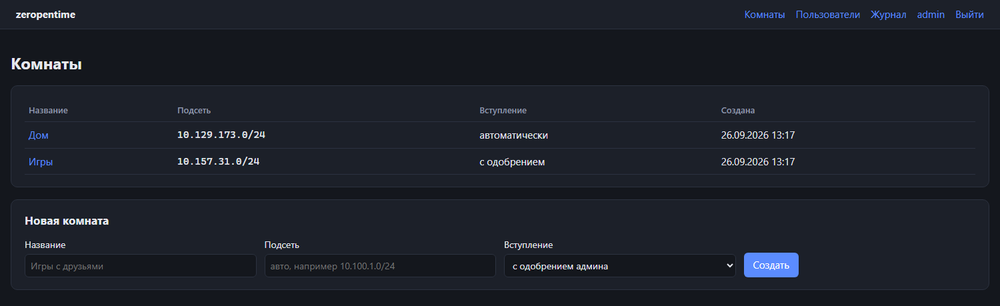 Забыли пароль: `zpt-controller passwd -db ФАЙЛ -login admin` выдаст новый.

## 3. Узел: установка

### Linux

Нужны права root, ядро с TUN (есть везде), для exit и kill switch — `nftables` (`nft`) и `iproute2` (`ip`), для DNS через exit / своего DNS — `systemd-resolved` (`resolvectl`).

```bash
tar xzf zpt_*_linux_amd64.tar.gz
sudo install -m 755 zpt /usr/local/bin/zpt
zpt version
```

### Windows

1. Скачайте `zpt_…_windows_amd64.zip` (или arm64) и распакуйте, например, в `C:\Program Files\zeropentime\`. В архиве уже есть `wintun.dll` — он должен лежать рядом с `zpt.exe`.
2. Все команды узла, кроме `zpt version`, выполняйте в терминале **от имени администратора** (правый клик по «Терминал» / PowerShell → «Запуск от имени администратора»).

```powershell
cd "C:\Program Files\zeropentime"
.\zpt.exe version
```

### Из исходников

```bash
go build -o zpt ./cmd/zpt                        # Go 1.26+
go build -o zpt-controller ./cmd/zpt-controller
bash scripts/fetch-wintun.sh                     # только для Windows: wintun.dll
```

## 4. Узел: вступить в комнату и запустить

1. В панели: комната → «Создать приглашение» (число использований, срок, «без одобрения»). Ссылка и QR-код показываются **один раз** — скопируйте команду кнопкой «Скопировать команду».

   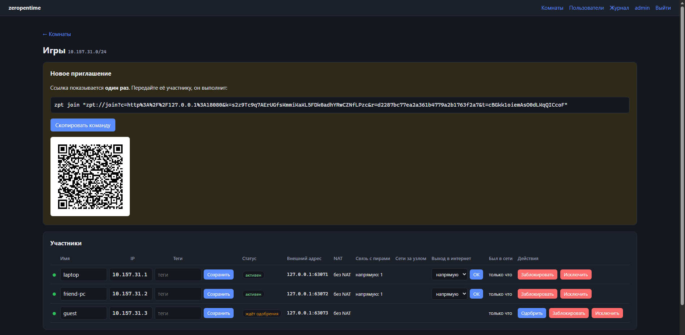
2. На устройстве:

   ```bash
   sudo zpt join -name laptop "zpt://join?c=...&r=...&k=...&t=..."
   sudo zpt up
   ```

   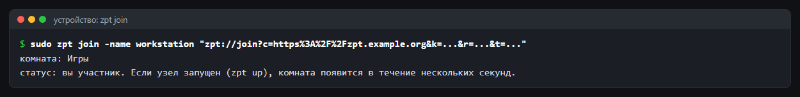

   `zpt join` создаёт ключ узла (если его нет), вступает в комнату и запоминает контроллер и ключ подписи комнаты. Если приглашение с одобрением, участник появится в панели со статусом «ждёт одобрения» — нажмите «Одобрить»; комната включится сама, перезапуск не нужен.

   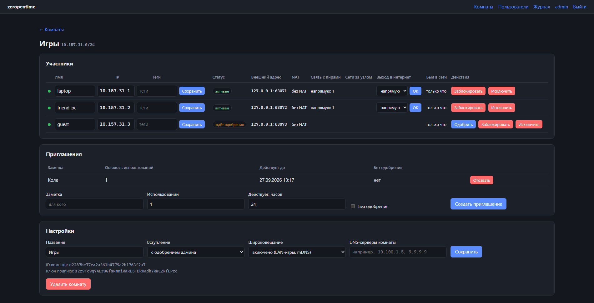
3. `zpt up` работает, пока открыт терминал (Ctrl+C — остановить). Новые участники, одобрения и исключения применяются за секунды.

   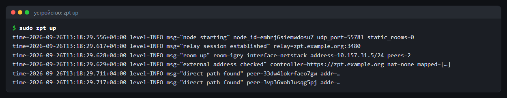

   В журнале видно: связь с relay, комната поднята (на снимке — демо-стенд без прав администратора, поэтому `interface=netstack`; обычно здесь `zpt-<комната>`), внешний адрес проверен, найдены прямые пути к пирам.

Проверка: у участника появился интерфейс `zpt-<комната>` с адресом из подсети комнаты; `ping` на IP другого участника (виден в панели) проходит.

На Windows интерфейс комнаты сам получает профиль сети «Частная», чтобы брандмауэр пропускал ping и общие папки.

Выйти из комнаты: `zpt leave ID_КОМНАТЫ` (ID — в панели внизу страницы комнаты).

## 5. Узел как служба (автозапуск)

Одна команда ставит узел службой, которая запускается при загрузке и перезапускается при сбое:

```bash
sudo zpt service install                 # Linux: systemd, конфиг /etc/zeropentime/zpt.yaml
```

```powershell
.\zpt.exe service install                # Windows (терминал администратора): служба «zeropentime»,
                                         # конфиг C:\ProgramData\zeropentime\zpt.yaml
```

Конфиг создаётся пустым, если его нет; другой путь — `zpt service install -c ПУТЬ`. Команды `join`, `exit`, `dns`, `leave` запускайте с тем же конфигом (`-c`), если он не лежит там, где его ищет узел по умолчанию: ключ и `state.json` у службы и у команд одни и те же (раздел 16).

| Команда | Что делает |
|---|---|
| `zpt service status` | состояние службы |
| `zpt service start` / `stop` / `restart` | запустить, остановить, перезапустить |
| `zpt service uninstall` | остановить и удалить службу |
| `zpt logs` / `zpt logs -f` / `zpt logs -n 200` | журнал службы: последние строки / следить за новыми |

На Linux журнал — в journald (`zpt logs` вызывает `journalctl -u zpt`), на Windows — в файле `C:\ProgramData\zeropentime\zpt.log` (при размере больше 10 МБ старый файл переименовывается в `zpt.log.old`).

Вручную (без `zpt service`) юнит systemd можно поставить из [deploy/systemd/zpt.service](../deploy/systemd/zpt.service).

## 6. Управление из терминала

Работающий узел (служба или `zpt up`) отвечает на команды через локальный канал — Unix-сокет `/run/zeropentime/zpt.sock` на Linux, именованный канал `\\.\pipe\zeropentime` на Windows. Доступ — только у root / администраторов, поэтому команды выполняйте через `sudo` или в терминале администратора.

| Команда | Что показывает / делает |
|---|---|
| `zpt status` | узел, порт, контроллеры (есть ли связь, когда обновлялось), тип NAT и внешний адрес, relay (через UDP или VLESS), exit, kill switch, DNS, список комнат |
| `zpt rooms` | комнаты: интерфейс, адрес, сколько пиров на связи, exit, сети, DNS |
| `zpt peers [КОМНАТА]` | пиры: IP, связь (напрямую / через relay / нет), RTT, адрес, последнее рукопожатие, принято и отправлено |
| `zpt exit …`, `zpt dns …` | меняют выбор и применяют его сразу («применено»); если узел не запущен — применится при запуске |

У `status`, `rooms`, `peers` есть `-json` — для скриптов и мониторинга, например:

```bash
sudo zpt peers -json | jq '.[].peers[] | select(.path == "none") | .name'   # кто не на связи
```

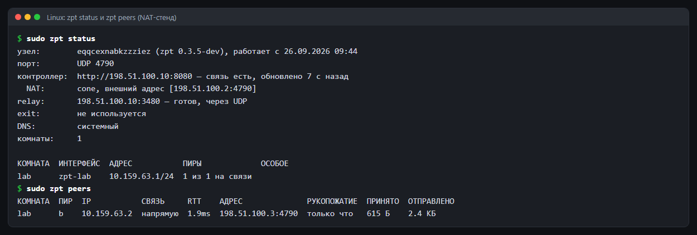

### Контроллер из терминала

Всё, что есть в панели, делается и командами `zpt-controller` на сервере — в том числе при запущенном контроллере (он замечает изменения за пару секунд). Комнату можно указывать ID или названием, участника — именем или ID узла; у просмотра есть `-json`.

```bash
zpt-controller room show   -db controller.db -room Дом                  # комната, участники, приглашения
zpt-controller member approve -db controller.db -room Дом -member laptop
zpt-controller member set  -db controller.db -room Дом -member laptop -tags "work,admin"
zpt-controller invite create -db controller.db -room Дом -url https://zpt.example.org -uses 5 -hours 48
zpt-controller invite list -db controller.db -room Дом
zpt-controller audit -db controller.db -n 20
```

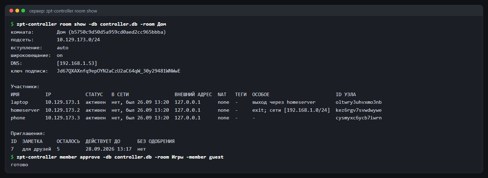

Полный список — в разделе 15 и в `zpt-controller` без аргументов.

## 7. Работа с комнатами

Всё — в панели на странице комнаты:

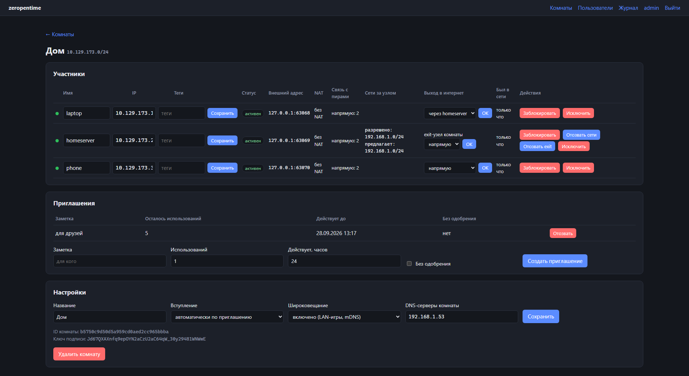

На снимке: `laptop` выходит в интернет через `homeserver`; `homeserver` — exit-узел комнаты и предлагает сеть `192.168.1.0/24`, которую админ разрешил; у комнаты свой DNS-сервер `192.168.1.53`.

- **Участники:** онлайн-статус, внешний адрес и тип NAT, сколько пиров видно напрямую и через relay; одобрить, заблокировать, исключить; сменить имя, IP и теги.
- **Приглашения:** создать (лимит, срок, без одобрения, заметка), отозвать.
- **Настройки:** название, режим вступления, широковещание (LAN-игры и mDNS: вкл / только mDNS / выкл), DNS-серверы комнаты.
- **Журнал** (меню сверху): все действия всех админов и узлов.

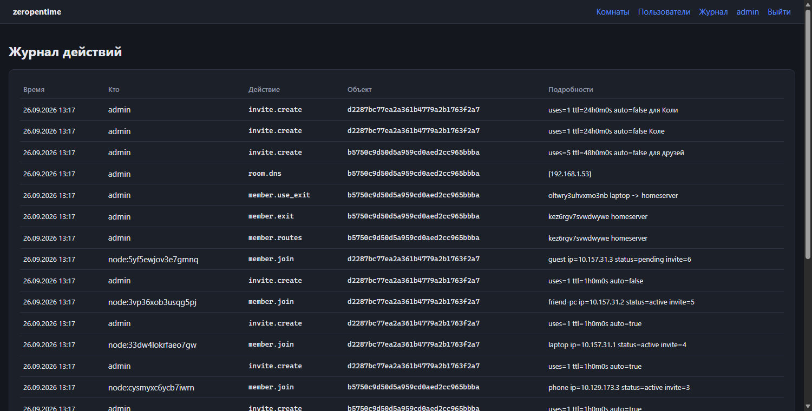

То же из терминала сервера (работает и при запущенном контроллере):

```bash
zpt-controller room create -db ФАЙЛ -owner admin -name game -policy auto
zpt-controller room list   -db ФАЙЛ
zpt-controller invite create -db ФАЙЛ -room ID -url https://zpt.example.org -uses 5 -hours 48
```

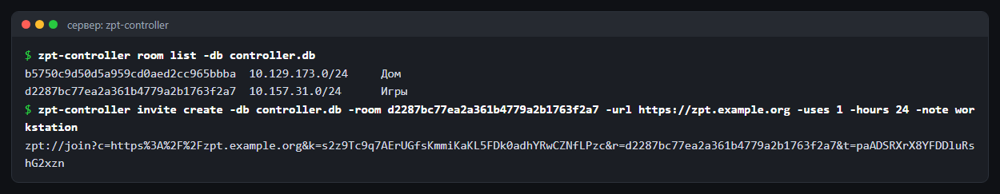

Всё то же самое — и командами `zpt-controller member …`, `room …`, `invite …` (раздел 6).

### Имена участников

К участникам можно обращаться по имени: `имя.комната.zpt`, например `ping laptop.dom.zpt` или `\\homeserver.dom.zpt\share` на Windows. Имена строятся из имён участников и комнаты латиницей (кириллица транслитерируется, пробелы становятся дефисами): участник «Домашний сервер» в комнате «Дом» — `domashniy-server.dom.zpt`. Зону комнаты показывает `zpt rooms`.

Имена отвечает DNS-сервер комнаты на вашем же узле; на Linux нужен systemd-resolved, на Windows ничего настраивать не нужно.

### Правила доступа

По умолчанию в комнате все видят всех. Правила ограничивают это: если они заданы, разрешено только то, что разрешают правила (ответы на разрешённые соединения проходят всегда). Их задаёт админ в разделе «Правила доступа» на странице комнаты или командой `zpt-controller acl set -db ФАЙЛ -room Игры -file rules.txt`.

```text
# гости — только на игровой сервер
allow tag:guest -> tag:game udp:27015-27030 tcp:27015
# свои — куда угодно, в том числе в интернет через exit
allow tag:family -> *
# все могут пинговать домашнюю сеть
allow * -> 192.168.1.0/24 icmp
```

ОТКУДА и КУДА — `*`, `tag:тег` (теги задаются у участника), имя участника, IP или сеть; КУДА ещё `internet` — выход через exit-узел. Порты — `tcp:22`, `udp:27015-27030`, `tcp:*`, `icmp`; без портов — любые.

Проверить, не открывая настоящих соединений, — «Проверка «что если»» под редактором или `zpt-controller acl test -db ФАЙЛ -room Игры -from guest-pc -to game-server -proto udp -port 27015`.

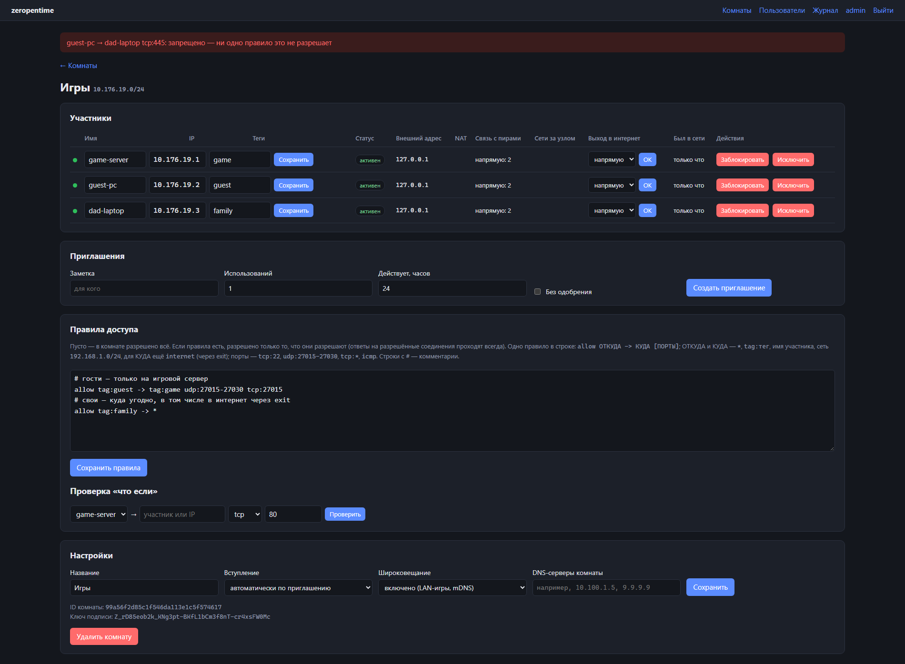

## 8. Доступ к сети за узлом (subnet router)

Чтобы участники видели устройства вашей домашней или офисной сети (NAS, принтер, камеры), на узле в этой сети (Linux) добавьте в конфиг:

```yaml
advertise_routes: [192.168.1.0/24]
```

Перезапустите узел и нажмите в панели «Разрешить сети» у этого участника (или `zpt-controller routes approve -db ФАЙЛ -room ID -member ИМЯ`). Устройствам в сети настраивать ничего не нужно. Отзыв — «Отозвать сети» / `routes revoke`.

## 9. Выход в интернет через узел (exit)

**Exit-узел** — Linux или Windows, например домашний сервер или компьютер. В его конфиге:

```yaml
advertise_exit: true
# exit_dns_upstreams: [192.168.1.53]   # по желанию: свой резолвер для пользователей exit
# exit_rate_limit: 20                  # по желанию: не больше 20 Мбит/с на клиента (в каждую сторону)
# exit_rate_limit_total: 100           # по желанию: не больше 100 Мбит/с на всех
# exit_nat: auto                       # auto | kernel (Linux, nftables) | userspace (встроенный NAT)
```

Админ разрешает его: «Разрешить exit» в панели или `zpt-controller exit approve -db ФАЙЛ -room ID -member ИМЯ`.

**Клиент** (Linux и Windows) выбирает exit:

```bash
sudo zpt exit game homeserver     # комната и имя участника-exit
sudo zpt exit                     # показать выбор
sudo zpt exit off                 # не выходить через exit, даже если назначил админ
sudo zpt exit auto                # как назначил админ в панели («Выход в интернет» у участника)
```

Проверка: `curl ifconfig.me` показывает внешний IP exit-узла.

Что происходит: весь IPv4-интернет и все DNS-запросы идут через exit; IPv6-интернет на это время закрыт, чтобы трафик не утекал мимо; локальная сеть, комнаты и разрешённые сети идут своими путями. Локальная сеть самого exit-узла пользователям закрыта.

На Windows (и на Linux с `exit_nat: userspace`) exit работает через встроенный NAT: соединения TCP и UDP клиентов открываются обычными сокетами exit-узла, настраивать систему не нужно. Ping (ICMP) через такой exit не проходит — это ограничение встроенного NAT; на Linux с `exit_nat: kernel` ping работает.

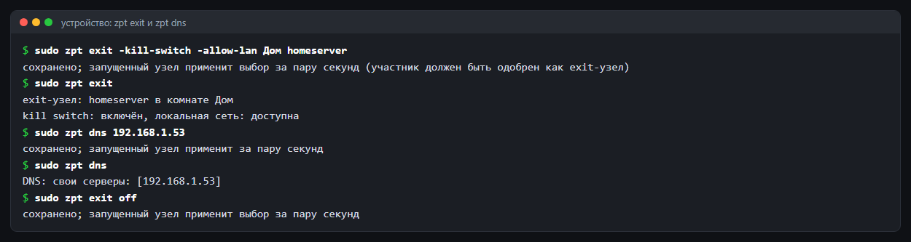

## 10. Kill switch

Чтобы при пропаже exit интернет не пошёл напрямую:

```bash
sudo zpt exit -kill-switch game homeserver
sudo zpt exit -kill-switch -allow-lan game homeserver   # своя LAN остаётся доступной
```

Для exit, назначенного админом, то же в конфиге узла: `kill_switch: true`, `kill_switch_allow_lan: true`. Комнаты и связь узла с контроллером при kill switch работают; интернет возвращается сам, когда exit снова доступен. Снять — `zpt exit off`.

На Linux правила остаются и после сбоя узла (интернет закрыт, пока не выполните `zpt exit off`); на Windows система снимает их при завершении узла.

## 11. Свой DNS-сервер

Свой DNS-сервер может быть **внутри сети** — участник комнаты или устройство в разрешённой сети за узлом (например, Pi-hole или AdGuard Home дома) — или **вне её**, в интернете. Им пользуются для всех имён.

- **Для всей комнаты** (админ): «DNS-серверы комнаты» в настройках комнаты или `zpt-controller room dns -db ФАЙЛ -room ID -servers "10.100.1.5, 9.9.9.9"` (пусто — убрать). До трёх серверов.
- **На своём устройстве** (важнее настроек комнаты):

  ```bash
  sudo zpt dns 192.168.1.53          # один-три сервера
  sudo zpt dns off                   # не брать DNS комнат
  sudo zpt dns auto                  # как в конфиге (dns: [...]) и комнатах
  sudo zpt dns                       # показать выбор
  ```

  или в конфиге узла: `dns: [192.168.1.53]`.
- **Для пользователей exit** — на exit-узле: `exit_dns_upstreams: [...]`.

Порядок выбора: свой DNS устройства → при выходе через exit — DNS комнаты exit-узла, иначе DNS-форвардер exit-узла → без exit — DNS первой комнаты, где он задан. Сервер внутри сети должен быть доступен: IP участника или адрес в разрешённой сети за узлом.

На Linux DNS настраивается через systemd-resolved, на Windows — DNS интерфейса комнаты и правило NRPT.

## 12. Когда блокируют UDP: VLESS + REALITY

Если у участников режут UDP, узлы сами переходят на VLESS + REALITY по TCP до relay контроллера. На контроллере:

```bash
zpt-controller serve -db ФАЙЛ -url https://zpt.example.org -vless :8443 -vless-dest www.microsoft.com:443
```

`-vless-dest` — настоящий сайт с TLS 1.3, который будет имитироваться. Ключи создаются и раздаются узлам автоматически. В конфиге узла можно принудить транспорт: `relay_transport: vless` (или `udp`, по умолчанию `auto`).

## 13. Статические комнаты без контроллера

Для двух-трёх своих устройств без сервера:

```bash
zpt keygen -key node.key       # ключ устройства
zpt room new                   # секрет комнаты — раздать участникам
zpt pubkey -c zpt.yaml         # свой публичный ключ — отдать пирам
sudo zpt up -c zpt.yaml
```

Комнаты и пиры описываются в YAML — пример: [deploy/examples/zpt.yaml](../deploy/examples/zpt.yaml). Нужны прямой адрес или проброшенный UDP-порт хотя бы у одной стороны.

## 14. Справочник: конфиг узла

Конфиг необязателен для узлов с контроллером. По умолчанию `zpt` ищет `zpt.yaml` в текущем каталоге; другой — флагом `-c`.

| Ключ | По умолчанию | Смысл |
|---|---|---|
| `key_file` | Linux `/var/lib/zeropentime/node.key`, Windows `C:\ProgramData\zeropentime\node.key` | ключ узла; рядом — `state.json` |
| `listen_port` | 4790 | один UDP-порт на все комнаты (0 — случайный) |
| `log_level` | `info` | `debug`, `info`, `warn`, `error` |
| `portmap` | `true` | проброс порта на роутере через UPnP / NAT-PMP |
| `relay_transport` | `auto` | до relay: `auto`, `udp`, `vless` |
| `userspace` | `false` | без интерфейсов ОС (для тестов) |
| `advertise_routes` | — | сети за узлом для комнат (раздел 8) |
| `advertise_exit` | `false` | предложить себя как exit (раздел 9) |
| `exit_dns_upstreams` | системные (`/etc/resolv.conf`, на Windows — DNS сетевых адаптеров) | резолверы exit-узла для его пользователей |
| `exit_nat` | `auto` | как exit пересылает трафик: `kernel` — nftables (только Linux), `userspace` — встроенный NAT (любая ОС); `auto` — kernel на Linux, userspace на остальных |
| `exit_rate_limit`, `exit_rate_limit_total` | 0 (без ограничения) | скорость exit в Мбит/с: на клиента и на всех, в каждую сторону |
| `kill_switch`, `kill_switch_allow_lan` | `false` | kill switch для exit, назначенного админом (раздел 10) |
| `dns` | — | свои DNS-серверы устройства (раздел 11) |
| `rooms` | — | статические комнаты (раздел 13) |

## 15. Справочник: команды

### Узел `zpt`

| Команда | Что делает |
|---|---|
| `zpt join [-c КОНФИГ] [-name ИМЯ] ССЫЛКА` | вступить в комнату по приглашению |
| `zpt up [-c КОНФИГ]` | запустить узел |
| `zpt leave [-c КОНФИГ] ID_КОМНАТЫ` | выйти из комнаты |
| `zpt exit [-kill-switch [-allow-lan]] КОМНАТА УЧАСТНИК` / `off` / `auto` | выход в интернет через exit |
| `zpt dns IP…` / `off` / `auto` | свой DNS-сервер |
| `zpt keygen [-key ФАЙЛ]` | создать ключ узла |
| `zpt pubkey -c КОНФИГ` | публичные ключи в статических комнатах |
| `zpt room new` | секрет статической комнаты |
| `zpt status` / `zpt rooms` / `zpt peers [КОМНАТА]` `[-json]` | состояние работающего узла (раздел 6) |
| `zpt service install [-c КОНФИГ]` / `uninstall` / `start` / `stop` / `restart` / `status` | служба (раздел 5) |
| `zpt logs [-f] [-n N]` | журнал службы |
| `zpt version` | версия |

### Контроллер `zpt-controller`

| Команда | Что делает |
|---|---|
| `serve -db ФАЙЛ -url URL [флаги]` | запустить контроллер (флаги — раздел 2 и `zpt-controller` без аргументов) |
| `useradd -db ФАЙЛ -login ЛОГИН [-admin]` | создать пользователя панели (пароль печатается) |
| `passwd -db ФАЙЛ -login ЛОГИН` | выдать новый пароль |
| `room create -owner ЛОГИН -name ИМЯ [-subnet …] [-policy manual/auto]` | создать комнату |
| `room list` / `room show -room R` | список комнат / комната с участниками и приглашениями |
| `room set -room R [-name …] [-policy …] [-broadcast on/off/mdns]` | настройки комнаты |
| `room dns -room R -servers "…"` / `room delete -room R` | DNS комнаты / удалить комнату |
| `member list -room R` | участники |
| `member approve`, `ban`, `unban`, `kick` `-room R -member M` | одобрить, заблокировать, разблокировать, исключить |
| `member set -room R -member M [-name …] [-ip …] [-tags "…"]` | имя, IP, теги участника |
| `invite list -room R` / `invite revoke -room R -id N` | приглашения |
| `user add -login ЛОГИН [-admin]` / `user list` / `user delete -login ЛОГИН` / `user passwd -login ЛОГИН` | пользователи панели |
| `audit [-n 50]` | журнал действий |
| `invite create -room ID -url URL [-uses N] [-hours N] [-auto] [-note ТЕКСТ]` | приглашение |
| `routes approve\|revoke -room ID -member ИМЯ` | сети за узлом |
| `exit approve\|revoke -room ID -member ИМЯ` | exit-узлы |
| `exit use -room ID -member ИМЯ [-via ИМЯ_EXIT]` | назначить участнику exit |

У всех команд `-db ФАЙЛ`; `-room` — ID или название комнаты, `-member` — имя или ID узла; у команд просмотра `-json`.

## 16. Файлы и порты

| Что | Linux | Windows |
|---|---|---|
| ключ узла | `/var/lib/zeropentime/node.key` | `C:\ProgramData\zeropentime\node.key` |
| состояние (комнаты, выбор exit и DNS) | `/var/lib/zeropentime/state.json` | `C:\ProgramData\zeropentime\state.json` |
| интерфейсы комнат | `zpt-<комната>` | `zpt-<комната>` |
| порт узла | UDP 4790 | UDP 4790 |

Ключ и `state.json` доступны только root / администраторам. Если на роутере нет UPnP / NAT-PMP, пробросьте UDP 4790 на устройство вручную — связь станет прямой чаще.

## 17. Обновление и удаление

**Обновление:** остановите узел или контроллер, замените бинарник, запустите снова. Контроллер сам обновляет схему базы; перед обновлением сделайте копию файла базы. В пределах одной вехи (0.3.x) узлы и контроллер разных версий совместимы.

**Удаление узла (Linux):** `sudo zpt service uninstall`, `sudo zpt exit off`, удалить `/usr/local/bin/zpt`, `/etc/zeropentime`, `/var/lib/zeropentime`. **Windows:** `zpt service uninstall`, `zpt exit off`, удалить папку программы и `C:\ProgramData\zeropentime`.

## 18. Если что-то не работает

| Симптом | Что проверить |
|---|---|
| `zpt up`: «запустите терминал от имени администратора» | Windows: терминал с правами администратора |
| комната не появляется после `join` | статус в панели: «ожидает» — одобрите; узел запущен (`zpt up`) |
| участники не пингуются | в панели «Связь с пирами»: если пусто — проверьте, что у контроллера открыты UDP 3478–3480; на Windows у получателя сеть «Частная» |
| связь только через relay | нормально для симметричного NAT; помогает проброс UDP 4790 или UPnP на роутере |
| у участника закрыт UDP | включите VLESS на контроллере (раздел 12) |
| нет интернета через exit | exit разрешён в панели? `zpt exit` показывает выбор? на exit-узле установлен `nftables`? |
| после сбоя нет интернета (Linux) | остался kill switch: `sudo zpt exit off` |
| не резолвятся имена `*.zpt` | `zpt rooms` показывает зону? Linux: работает ли systemd-resolved (`resolvectl status` — у интерфейса комнаты домен `~комната.zpt`) |
| DNS не идёт через exit / свой DNS | Linux: работает ли `systemd-resolved` (`resolvectl status`); узел пишет предупреждение в журнал |
| что с узлом сейчас | `sudo zpt status`, `sudo zpt peers` — связь с контроллером, путь к каждому пиру, рукопожатия |
| подробности | `log_level: debug` в конфиге; журнал — `zpt logs -f` (служба) или терминал `zpt up` |

Нашли ошибку — создайте issue на GitHub; уязвимость — по [SECURITY.md](../SECURITY.md).
